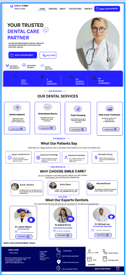
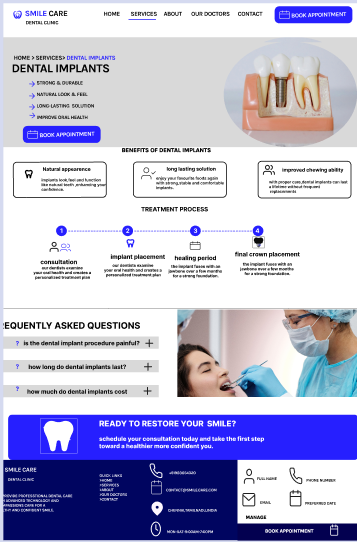
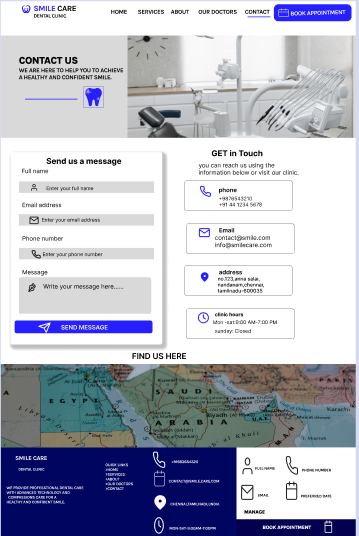

# FUTURE_UIUX_01

## Project Title
Dental Clinic Website UI/UX Design

## Description
This project is a modern and user-friendly Dental Clinic website design created as part of a UI/UX internship task. The design focuses on clean layouts, easy navigation, and an improved user experience for patients seeking dental services.

## Features
- Modern and responsive design
- User-friendly navigation
- Service information section
- Contact page for appointment inquiries
- Clean and professional interface

## Figma Design

[Figma Prototype](https://www.figma.com/proto/kiswHnTCLeRT5Nwi8q9lBu/dental-clinic?node-id=57-276&starting-point-node-id=57%3A276&t=8ak5WzibIn1X2g6o-1)

## Tools Used
- Figma
- UI/UX Design Principles

## Deliverables
- Design PDF
- Homepage Design
- Service Page Design
- Contact Page Design

## Screenshots

### Homepage

### Service Page

### Contact Page

## Files Included
- dental clinic.pdf
- homepage.png
- service-page.png
- contact-page.png
